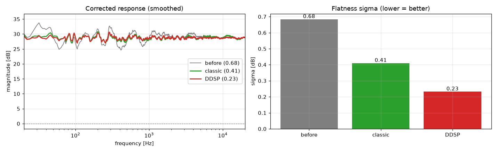
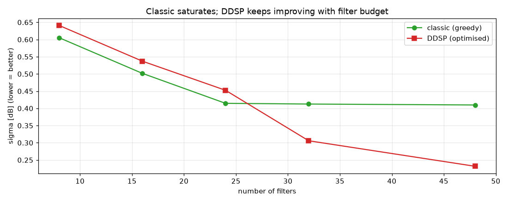

# ddsp-room-correction

> 측정한 방의 음향 특성을 분석해, **EQ 보정 필터를 자동으로 설계**하는 룸 보정(Room Correction) 프로젝트.
> 고전 신호처리 baseline과 **미분가능 최적화(Differentiable DSP)** 방식을 비교한다.


---

> 📖 오디오 신호처리 용어가 낯설다면 → [`docs/쉽게_이해하기.md`](docs/쉽게_이해하기.md) (비전공자용 설명)

## 한 줄 요약

방 안에서 측정한 **임펄스 응답(Room Impulse Response, RIR)** 으로부터 그 방의 주파수 응답 왜곡을
파악하고, 이를 목표 곡선(flat / Harman)에 맞추는 **이퀄라이저(EQ) 필터를 자동으로 찾아낸다.**
필터를 찾는 방법으로 **(1) 고전 규칙 기반**, **(2) 경사하강법 기반 미분가능 최적화**, **(3) FIR**
세 가지를 구현하고 정량·청감으로 비교한다.

## 결과 미리보기

고전 EQ · FIR · DDSP 세 방식을 공정 비교한다. 보정 전 σ 0.68 dB → 고전 0.41 → FIR 0.25 →
**DDSP 0.23 dB** (가청대역 주파수응답 표준편차, 낮을수록 평탄). 특히 **DDSP는 48개의 해석
가능한 파라미터만으로 4097탭 FIR과 동등 이상의 크기 평탄도**를 달성한다.



필터 개수를 늘리면 **고전 그리디는 σ≈0.40에서 포화**하지만, **DDSP는 게인을 동시에
최적화해 필터 예산이 늘수록 계속 개선**된다 (nf≥32부터 역전).



> 전체 분석 흐름·그래프는 [`notebooks/room_correction.ipynb`](notebooks/room_correction.ipynb) 참고.

## 왜 이 프로젝트인가

- 룸 보정은 "측정 데이터 → 분석 → 최적 파라미터 산출"이라는 구조를 가진다. 이는 제조 현장의
  공정 최적화·결함 분석과 동일한 골격이며, **신호처리와 머신러닝을 한 문제 위에서 묶어** 보여줄 수 있다.
- 특히 EQ 필터 파라미터를 "학습 가능한 변수"로 두고 **목표 곡선과의 오차를 손실 함수로 정의해
  경사하강법으로 최적화**하는 접근(DDSP)은, 전통 신호처리 문제를 ML 관점으로 재해석한 사례다.

## 작동 원리

```
[측정 RIR]  ──FFT──▶  [주파수 응답]  ──(목표 곡선과 비교)──▶  [보정해야 할 차이]
                                                                  │
                          ┌───────────────────────────────────────┤
                          ▼                  ▼                     ▼
                   (1) 고전 EQ         (2) DDSP EQ            (3) FIR
                  규칙 기반 배치     경사하강법 최적화        역컨볼루션
                          └───────────────────┬───────────────────┘
                                              ▼
                              [보정 전/후 주파수 응답 + 평가 지표(σ, RMSE)]
                                              ▼
                                  [A/B 청취 음원 · 스펙트로그램]
```

## 목표 곡선 (Target Curve)

- **flat**: 전 대역을 평탄하게 — 알고리즘이 "정말 평평하게 만들 수 있는가"를 증명하는 기준점.
- **Harman**: 청취 실험 기반 선호 곡선 — flat이 청감상 정답이 아니라는 점을 반영한 실사용 추천값.

## 평가

| 축 | 지표 | 설명 |
|----|------|------|
| 객관 (헤드라인) | 주파수 응답 표준편차 **σ** | 모든 결과에서 사용. 게인 불변 평탄도 (1/3-옥타브 스무딩 기준) |
| 객관 (보조) | RMSE (`metrics.deviation_rmse_db`) | 목표 곡선과의 RMS 편차 (레벨 정렬 후) |
| 청감 | A/B 음원(핑크노이즈) · 스펙트로그램 | 방 통과 보정 전/후를 귀와 눈으로 비교 |

> DDSP의 **손실 함수 = 목표 곡선과의 주파수 응답 편차 MSE** 로 두어, 최적화 목표와 평가 지표를 일치시킨다.

## 프로젝트 구조

```
ddsp-room-correction/
├── data/
│   ├── synthetic/   # 검증용 합성 RIR (정답을 아는 데이터)
│   ├── public/      # 공개 RIR 데이터셋 (메인 검증)
│   └── my_room/     # 직접 측정한 RIR (실전 데모)
├── src/
│   ├── io.py          # WAV 입출력
│   ├── analysis.py    # FFT, 주파수 응답 추출
│   ├── targets.py     # flat / Harman 목표 곡선
│   ├── eq_classic.py  # 고전 EQ (baseline)
│   ├── eq_ddsp.py     # 미분가능 최적화 EQ (메인)
│   ├── fir.py         # FIR 필터 (비교)
│   └── metrics.py     # 편차 σ / RMSE 평가
├── tests/             # pytest (TDD)
├── notebooks/         # 분석 스토리 · 시각화
└── app.py             # (보너스) Streamlit 데모
```

## 로드맵

- [x] **M1** 합성 RIR 생성 + WAV 입출력 + FFT 주파수 응답
- [x] **M2** 목표 곡선(flat) + 평가 지표(σ, RMSE)
- [x] **M3** 고전 EQ baseline (1/3-옥타브 스무딩 + 게인 클램프) — 실제 RIR에서 σ 약 40% 감소 *첫 완성품*
- [x] **M4** DDSP 최적화 EQ (PyTorch autograd) — 실제 RIR에서 σ 약 66% 감소 *헤드라인*
- [x] **M5a** Harman 목표곡선 옵션 (flat과 동일 인터페이스로 주입)
- [x] **M6a** 분석 노트북 + 보정 전/후·비교·nf 스윕 시각화
- [x] **M6b** FIR 보정 필터 (선형위상, 주파수 샘플링) — 3-way 비교 완성
- [x] **M6c** A/B 청취 음원 (보정 전/후 오디오 + 스펙트로그램, 노트북에 인라인 재생)
- [x] **M7** Streamlit 인터랙티브 데모 (`app.py`)
- [ ] **M5b** 공개 RIR 데이터셋 검증
- [ ] **M8** (보너스) 직접 측정한 RIR 적용

## 설치 & 실행

```bash
python -m venv .venv
# Windows
.venv\Scripts\activate
# macOS / Linux
source .venv/bin/activate

pip install -r requirements-dev.txt
pytest                       # 테스트 실행 (53개)
streamlit run app.py         # 인터랙티브 데모
jupyter notebook notebooks/room_correction.ipynb   # 분석 노트북
```

## 기술 스택

`Python 3.12` · `numpy` · `scipy` · `soundfile` · `matplotlib` · `pytorch`

## 한계 및 향후 과제

- 정식 블라인드 청취 실험(다수 피험자)은 범위 밖 — 향후 과제로 둔다.
- 실시간 임베디드 적용(예: Raspberry Pi 실시간 컨볼루션)은 확장 주제.

---

*개인 포트폴리오 프로젝트. TDD + 서브에이전트 코드 검증으로 단계별 구현.*
