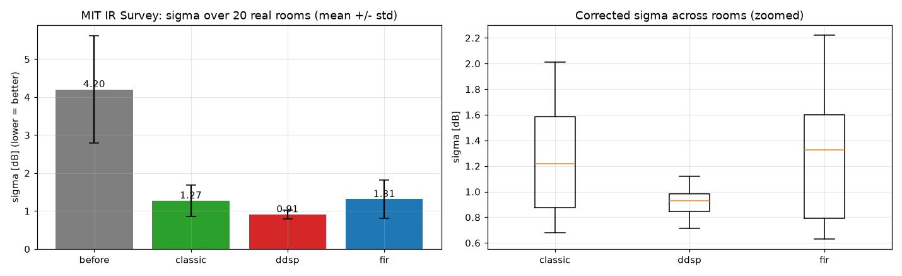

# ddsp-room-correction

> A room-correction project: analyze a room's acoustic response and **automatically design
> EQ correction filters**. Compares a classic signal-processing baseline against
> **differentiable optimization (DDSP)**.


> 📖 New to audio DSP terms? → [`docs/understanding.md`](docs/understanding.md) (plain-language explainer)

## TL;DR

From a measured **Room Impulse Response (RIR)**, this project finds the room's frequency-response
distortion and designs an **equalizer (EQ)** that flattens it toward a target curve (flat / Harman).
Three methods of finding the filters are implemented and compared, both quantitatively and by ear:
**(1) classic rule-based greedy**, **(2) gradient-descent differentiable optimization (DDSP)**, and **(3) FIR**.

## Results preview

Classic EQ, FIR, and DDSP are compared on equal footing. Pre-correction σ 0.68 dB → classic 0.41 →
FIR 0.25 → **DDSP 0.23 dB** (standard deviation of the audible-band frequency response; lower is flatter).
Notably, **DDSP reaches magnitude flatness equal to or better than a 4097-tap FIR using just 48
interpretable parameters**.


As the filter count grows, **the classic greedy method saturates around σ≈0.40**, while **DDSP keeps
improving because it optimizes all gains jointly** (DDSP overtakes from nf≥32 onward).


### Holds up on real measured rooms

The synthetic story is clean, but the real test is measured rooms. Validated on 20 rooms from the
**MIT IR Survey** (Traer & McDermott, PNAS 2016 — bedrooms, offices, classrooms; outdoor/transit
recordings excluded), reporting σ as mean ± std across rooms:

| Method | σ (mean ± std) | |
|---|---|---|
| before | 4.20 ± 1.42 | jagged real rooms |
| classic greedy EQ | 1.27 ± 0.42 | |
| FIR (linear phase) | 1.31 ± 0.51 | |
| **DDSP optimized EQ** | **0.91 ± 0.11** | flattest **and** most consistent (¼ the spread) |

**DDSP is both the flattest on average and the most consistent room-to-room.** Note the honest twist:
on these short, noisy 16 kHz measurements the frequency-sampled **FIR drops behind both EQ methods** —
the synthetic ranking does not transfer blindly, which is exactly why measured-data validation matters.
(σ is measured on the same band the filters correct, capped just below the 8 kHz Nyquist.)



> Full analysis and figures: [`notebooks/room_correction.ipynb`](notebooks/room_correction.ipynb).
> Fetch the dataset once with `python scripts/download_mit_rir.py` (gitignored, not stored in the repo).

## Why this project

- Room correction follows a "measure → analyze → derive optimal parameters" structure — the same
  skeleton as process optimization and defect analysis in manufacturing. It lets us tie **signal
  processing and machine learning together on one problem**.
- In particular, treating EQ filter parameters as **learnable variables and optimizing a loss
  (deviation from the target curve) via gradient descent** (DDSP) reframes a classic DSP problem
  through an ML lens.

## How it works

```
[measured RIR] ──FFT──▶ [frequency response] ──(compare to target)──▶ [deviation to correct]
                                                                          │
                          ┌────────────────────────────────────────────────┤
                          ▼                  ▼                            ▼
                   (1) classic EQ      (2) DDSP EQ                   (3) FIR
                  rule-based greedy   gradient descent          inverse / deconvolution
                          └───────────────────┬────────────────────────────┘
                                              ▼
                          [before/after frequency response + metrics (σ, RMSE)]
                                              ▼
                              [A/B listening audio · spectrogram]
```

## Target curve

- **flat**: flatten the whole band — the reference point that proves the algorithm can truly flatten.
- **Harman**: a listener-preference curve — reflects that flat is not perceptually ideal; a real-world recommendation.

## Evaluation

| Axis | Metric | Description |
|------|--------|-------------|
| Objective (headline) | response std **σ** | Used in all results. Gain-invariant flatness (on the 1/3-octave-smoothed response) |
| Objective (secondary) | RMSE (`metrics.deviation_rmse_db`) | RMS deviation from the target curve (after level alignment) |
| Perceptual | A/B audio (pink noise) · spectrogram | Hear and see the in-room before/after |

> The DDSP **loss = MSE of the deviation from the target curve**, so the optimization objective and the evaluation metric coincide.

## Project layout

```
ddsp-room-correction/
├── data/
│   ├── synthetic/   # synthetic RIRs for validation (ground truth known)
│   ├── public/      # public RIR datasets (main validation)
│   └── my_room/     # self-measured RIRs (real-world demo)
├── src/
│   ├── io.py          # WAV I/O
│   ├── analysis.py    # FFT, frequency response, fractional-octave smoothing
│   ├── targets.py     # flat / Harman target curves
│   ├── eq_classic.py  # classic EQ (baseline)
│   ├── eq_ddsp.py     # differentiable optimization EQ (headline)
│   ├── fir.py         # FIR filter (comparison)
│   ├── audio.py       # apply correction to real audio
│   ├── metrics.py     # σ / RMSE evaluation
│   ├── datasets.py    # MIT IR Survey listing + indoor/outdoor filtering
│   ├── evaluation.py  # per-RIR before/after σ for the multi-room & multi-seed studies
│   └── pipeline.py    # unified interface over the three methods
├── scripts/
│   └── download_mit_rir.py   # fetch the MIT IR Survey into data/public/ (gitignored)
├── tests/             # pytest (TDD)
├── notebooks/         # analysis story · visualization
└── app.py             # Streamlit demo
```

## Roadmap

- [x] **M1** synthetic RIR + WAV I/O + FFT frequency response
- [x] **M2** target curve (flat) + metrics (σ, RMSE)
- [x] **M3** classic EQ baseline (1/3-octave smoothing + gain clamp) — ~40% σ reduction on real RIRs *first complete product*
- [x] **M4** DDSP optimization EQ (PyTorch autograd) — ~66% σ reduction on real RIRs *headline*
- [x] **M5a** Harman target-curve option (same interface as flat)
- [x] **M6a** analysis notebook + before/after, comparison, nf-sweep plots
- [x] **M6b** FIR correction filter (linear-phase, frequency sampling) — completes the 3-way comparison
- [x] **M6c** A/B listening audio (before/after + spectrogram, inline playback in the notebook)
- [x] **M7** Streamlit interactive demo (`app.py`)
- [x] **M5b** validation on a public RIR dataset (MIT IR Survey, 20 real rooms) — DDSP flattest & most consistent
- [ ] **M8** (bonus) apply to self-measured RIRs

## Install & run

```bash
python -m venv .venv
# Windows
.venv\Scripts\activate
# macOS / Linux
source .venv/bin/activate

pip install -r requirements-dev.txt
pytest                       # run tests (66)
streamlit run app.py         # interactive demo
jupyter notebook notebooks/room_correction.ipynb   # analysis notebook

# optional: fetch real measured RIRs for the section-8 validation (gitignored)
python scripts/download_mit_rir.py
```

## Tech stack

`Python 3.12` · `numpy` · `scipy` · `soundfile` · `matplotlib` · `pytorch`

## Limitations & future work

- The real-RIR validation uses the 16 kHz MIT IR Survey mirror, so the correction band is capped just
  under 8 kHz. A full-rate measurement set would extend the comparison to the top octave.
- Formal blind listening tests (multiple subjects) are out of scope — left as future work.
- Real-time embedded deployment (e.g. real-time convolution on a Raspberry Pi) is an extension topic.

---

*Personal portfolio project. Built step-by-step with TDD and staged code review.*
